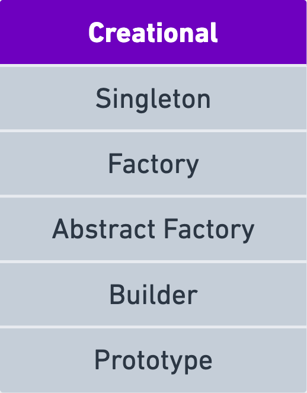

    

These patterns provide guidelines for object creation mechanisms, trying to make object creation more flexible, efficient, and independent of the system.

- [Singleton:](https://refactoring.guru/design-patterns/singleton)

  The Singleton pattern ensures that a class has only one instance and provides a global point of access to that instance. This is useful when exactly one object is needed to coordinate actions across the system, like a configuration manager or a logging service.

- [Factory Method:](https://refactoring.guru/design-patterns/factory-method)

  The Factory Method pattern defines an interface for creating an object but allows subclasses to alter the type of objects that will be created. It encapsulates the instantiation process, promoting loose coupling between client code and the objects being created.

- [Abstract Factory](https://refactoring.guru/design-patterns/abstract-factory)

  The Abstract Factory pattern provides an interface for creating families of related or dependent objects without specifying their concrete classes. It allows you to ensure that the created objects are compatible and can work together seamlessly.

- [Builder](https://refactoring.guru/design-patterns/builder)

  The Builder pattern separates the construction of a complex object from its representation. It allows the same construction process to create different representations. This is particularly useful when creating complex objects with numerous optional parameters.

- [Prototype](https://refactoring.guru/design-patterns/prototype)

  The Prototype pattern specifies the kind of objects to create by cloning an existing instance, known as the prototype. This pattern is beneficial when creating objects is more efficient by copying an existing instance than by creating them from scratch.

Each of these creational design patterns addresses different aspects of object creation, offering flexibility, maintainability, and scalability to software systems. By understanding and applying these patterns, developers can create more robust and adaptable software solutions while promoting code reusability and maintainability, which are core principles of object-oriented design. These creational design patterns are valuable tools in a software engineer's toolkit for building efficient and modular software systems.

## Portuguese 🇧🇷

Esses padrões fornecem diretrizes para mecanismos de criação de objetos, buscando tornar a criação de objetos mais flexível, eficiente e independente do sistema.

- [Singleton:](https://refactoring.guru/design-patterns/singleton)

O padrão Singleton garante que uma classe tenha apenas uma instância e fornece um ponto de acesso global a essa instância. Isso é útil quando exatamente um objeto é necessário para coordenar ações em todo o sistema, como um gerenciador de configuração ou um serviço de registro.

- [Factory Method:](https://refactoring.guru/design-patterns/factory-method)

O padrão Factory Method define uma interface para criar um objeto, mas permite que subclasses alterem o tipo de objetos que serão criados. Ele encapsula o processo de instância, promovendo baixo acoplamento entre o código cliente e os objetos que estão sendo criados.

- [Abstract Factory](https://refactoring.guru/design-patterns/abstract-factory)

O padrão Abstract Factory fornece uma interface para criar famílias de objetos relacionados ou dependentes sem especificar suas classes concretas. Isso permite garantir que os objetos criados sejam compatíveis e possam trabalhar juntos sem problemas.

- [Builder](https://refactoring.guru/design-patterns/builder)

O padrão Builder separa a construção de um objeto complexo de sua representação. Isso permite que o mesmo processo de construção crie representações diferentes. Isso é particularmente útil ao criar objetos complexos com numerosos parâmetros opcionais.

- [Prototype](https://refactoring.guru/design-patterns/prototype)

O padrão Prototype especifica o tipo de objetos a serem criados clonando uma instância existente, conhecida como protótipo. Esse padrão é benéfico quando a criação de objetos é mais eficiente ao copiar uma instância existente do que criá-los do zero.

Cada um desses padrões de design de criação aborda diferentes aspectos da criação de objetos, oferecendo flexibilidade, manutenibilidade e escalabilidade aos sistemas de software. Ao compreender e aplicar esses padrões, os desenvolvedores podem criar soluções de software mais robustas e adaptáveis, promovendo a reutilização e a manutenção de código, que são princípios fundamentais do design orientado a objetos. Esses padrões de design de criação são ferramentas valiosas no arsenal de um engenheiro de software para construir sistemas de software eficientes e modulares.

